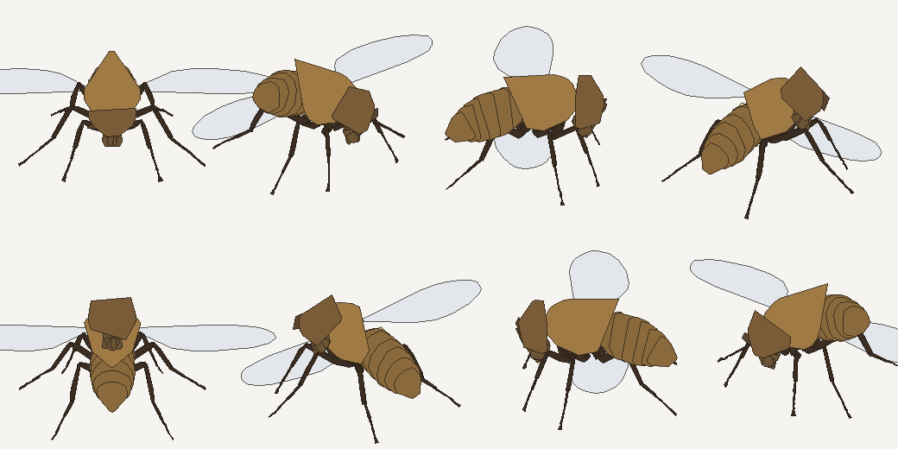

# flypong

Teaching Google DeepMind's virtual fruit fly to play table tennis, and then
putting it in a browser so you can rally against it.



## What the fly actually is

In 2024 Google DeepMind and HHMI Janelia Research Campus released **flybody**,
an anatomically detailed model of *Drosophila melanogaster* for the MuJoCo
physics engine; the paper appeared in *Nature* in 2025. It is not a picture of
a fly, it is a fly-shaped mechanism: 68 body segments, 109 generalised
coordinates, 78 actuators, and a measured mass of 0.98 mg. Building it needed
new MuJoCo features — adhesion actuators for feet that grip, and a fluid model
for the forces on a body this small moving through air.

You can get it two ways:

```bash
# the body alone, as MJCF -- this is what this project uses
git clone --depth 1 --filter=blob:none --sparse \
    https://github.com/google-deepmind/mujoco_menagerie.git
cd mujoco_menagerie && git sparse-checkout set flybody

# the full research repo: RL task suite, training code, reference policies
# https://github.com/TuragaLab/flybody
```

This project never edits `fruitfly.xml`. The table, net, ball and the paddle on
the fly's thorax are grafted on at load time with MuJoCo's spec API
(`scene.py`), so the animal stays exactly as published.

## What gets trained

Training the full 78-actuator body to fly is a distributed-RL problem and not
something a laptop does. So the fly is controlled where a nervous system would
control it — at the level of flight *commands*, not wingstrokes. The policy
outputs six numbers at 500 Hz:

| output | meaning |
| --- | --- |
| `thrust x, y, z` | commanded body acceleration, up to 2200 cm/s² (~2.2 g) |
| `yaw`, `pitch` | orientation of the paddle face |
| `swing` | impulse along the paddle normal; negative takes pace off |

Gravity is not cancelled for free — the policy has to hold the fly up.

The learner is an **evolution strategy**, not a policy gradient. What we care
about ("did the return land on the far half") is a sparse, discontinuous event
at the end of a 70 ms rally. ES optimises that episode return directly, needs
no value function, and vectorises perfectly: one `einsum` scores a population
of 320 perturbations across 1920 simultaneous rallies. On four CPU cores a
generation takes about half a second.

## Does the reduction hold up?

A reduced model is only worth having if the real animal behaves the same way.
`mujoco_eval.py` records the thrust commands from a rally and replays exactly
those commands into the full 109-DoF body in MuJoCo:

```
open-loop replay, wings level
  RMS divergence    0.03 cm over a ~50 ms rally  (~10% of a body length)
```

So a commanded force moves the real articulated body — dangling legs, fluid
drag and all — very nearly the way it moves the point mass the policy trained
against.

One result worth stating because it cuts the other way: layering a **canned
220 Hz sinusoidal wingbeat** on top pushes that divergence to **0.34 cm**, with
the fly sinking 0.7 cm. A naive flap is not lift-neutral in MuJoCo's fluid
model. Real flight needs a *learned* wing gait — which is precisely what
flybody's own flight controller provides and what this project's abstraction
deliberately steps over. The wingbeat you see in the browser is animation, and
is labelled as such.

## Layout

| file | what it does |
| --- | --- |
| `physics.py` | the dynamics spec — court, ball, swept paddle contact, flight. One source of truth, transcribed into JS for the browser. |
| `env.py` | batched rally environment; thousands of rallies stepped in lockstep |
| `policy.py` | the MLP (20 → 48 → 48 → 6), evaluated with one weight set per world |
| `train.py` | the evolution strategy, with a serve curriculum |
| `scene.py` | grafts table, net, ball and paddle onto the real flybody model |
| `mujoco_eval.py` | reduced-vs-real validation, open and closed loop |
| `measure_fly.py` | extracts mass, span and per-part silhouettes from the meshes |
| `game.template.html` | the playable page |
| `export_policy.py` | bakes weights + shape into a single self-contained HTML file |

## Running it

```bash
pip install numpy mujoco
python measure_fly.py --menagerie /path/to/menagerie/flybody
python train.py --generations 3000 --out runs/S11.npy
python mujoco_eval.py --policy runs/S11.npy --rallies 30
python export_policy.py --policy runs/S11.npy --out ../flypong_game.html
```

## Two honest notes about the game

**It runs in slow motion.** A fly-scale rally takes about a tenth of a second.
The chamber runs at 1/8 speed by default because the alternative is a game no
human can see, let alone play.

**Your shots are clamped.** After you hit, the ball's velocity is squeezed into
the band the policy was trained on. At this scale 18 cm/s is the difference
between a rally and a ball off the end of the table, and an opponent that
cannot reach anything is not a game. The fly's own shots are not clamped.

## Credit

Model: [google-deepmind/mujoco_menagerie/flybody](https://github.com/google-deepmind/mujoco_menagerie/tree/main/flybody),
Apache-2.0. Research repo: [TuragaLab/flybody](https://github.com/TuragaLab/flybody).

Vaxenburg, Siwanowicz, Merel, Robie, Morrow, Novati, Stefanidi, Card, Reiser,
Botvinick, Branson, Tassa, Turaga. *Whole-body physics simulation of fruit fly
locomotion.* Nature (2025). https://www.nature.com/articles/s41586-025-09029-4
